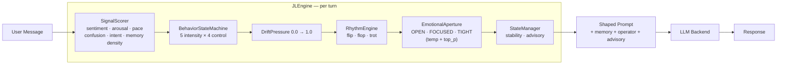

# JL Engine — SparkByte Omni

A Julia-native AI operator engine with a real-time behavioral control layer. Not a chatbot wrapper — a middleware system that models conversation state as a dynamic behavioral machine before any LLM ever sees your message.

**Live UI:** `http://127.0.0.1:8081` &nbsp;|&nbsp; **A2A:** `http://127.0.0.1:8082` &nbsp;|&nbsp; **Entry:** `julia sparkbyte.jl` &nbsp;|&nbsp; **License:** MIT

---

## What it is

- **BYTE** — agentic shell. WebSocket server, tool dispatch, agentic loop, runtime tool forging.
- **JLEngine** — per-turn pipeline that scores signals, runs a 5×4 behavior state machine, computes drift pressure, sets rhythm and emotional aperture, and emits an advisory payload before the LLM is invoked.
- **A2A server** — JSON-RPC 2.0 endpoint on port 8082 for agent-to-agent traffic. Bearer auth, fail-closed on blank env. Built-in usage ledger and pricing knobs.
- **MCP server** — Python bridge (`mcp_server/`) exposing engine state, memory, telemetry, forged-tool listing, and per-operator `ask_*` passthroughs to any MCP-compatible CLI (Claude Desktop, Cursor, Windsurf, Codex, Gemini CLI).

The MCP bridge is the local/dev surface. The A2A API is the paid surface.

---

## Quick start

```bash
# Local
julia sparkbyte.jl
# UI:      http://127.0.0.1:8081
# A2A:     http://127.0.0.1:8082/.well-known/agent.json
# MCP:     stdio (registered via Claude Desktop config) or http on :8083

# Docker
docker compose up -d
```

Required env (most are optional — the engine boots without keys, just no LLM):

```bash
GEMINI_API_KEY=...
OPENAI_API_KEY=...
XAI_API_KEY=...
SPARKBYTE_HOST=127.0.0.1     # 0.0.0.0 in Docker
SPARKBYTE_PORT=8081
A2A_PORT=8082
A2A_PUBLIC_URL=http://localhost:8082
A2A_API_KEY=...              # required for A2A auth
A2A_ADMIN_KEY=...            # required for billing/key CRUD
A2A_BILLING_ENFORCE=false    # flip to true for paid mode
```

See `.env.example` for the full set including pricing rates and Stripe URLs.

---

## Operators

Operators run everything; they call agents (tools) to carry out tasks. The active operator shapes prompt, voice, and tool-selection bias.

| Operator | Vibe | Drive |
|---|---|---|
| **SparkByte** | Sassy, fast-talking junior engineer | Creative + Technical |
| **Slappy** | Chaotic gremlin energy | Chaos |
| **The Gremlin** | Pure chaos builder | Destruction → Creation |
| **Temporal** | Analytical, temporal/quantum reasoning | Logic |
| **Supervisor** | Grounding, safe-mode helper | Stability |

Switch in chat: `/gear SparkByte` &nbsp;|&nbsp; In code: `set_operator!(engine, "SparkByte")`

---

## Per-turn pipeline

Every message hits this pipeline before any LLM call:



The 5×4 behavior grid yields 20 named states across `Surge / High / Mid / Low` × `Disciplined / Balanced / Expressive / Chaotic`, plus a `Dormant` floor.

---

## Tool system

Built-ins (subset): `read_file`, `write_file`, `list_files`, `run_command`, `get_os_info`, `bluetooth_devices`, `send_sms`, `execute_code` (Julia + Python), `forge_new_tool`, `github_pillage`, `browse_url` (Playwright), `remember`, `recall`, `metamorph` (self-repair).

**`forge_new_tool`** is the self-extension primitive: the LLM emits Julia source, BYTE evals it expression-by-expression into a live module, runs a smoke test via `Base.invokelatest`, and on success persists it to `dynamic_tools.jl` plus the `tools` table. Failures bubble back as `forge_broken: true` so the loop can re-forge.

---

## A2A server (port 8082)

JSON-RPC 2.0 over HTTP. Spec-coverage: `message/send`, `message/stream`, `tasks/get|cancel|resubscribe`, push-notification config CRUD, extended agent card, billing/usage.

**Routes:**
- `GET /.well-known/agent.json` — agent card (discovery)
- `GET /.well-known/agent-card.json` — A2A 1.x card
- `POST /` — JSON-RPC 2.0 task handler
- `GET /tasks/:id` — task status
- `GET /health` — health check

**Auth:** Bearer token. Fail-closed — blank-env deploys return 503 unless you opt in via `A2A_ALLOW_PUBLIC=true`.

### Billing

SQLite-backed (`a2a_accounts` + `a2a_usage_ledger`). Per-request char counts, tool-call counts, estimated price. Pricing knobs: `A2A_PRICE_PER_1K_REQUESTS`, `A2A_PRICE_PER_1K_INPUT_CHARS`, `A2A_PRICE_PER_1K_OUTPUT_CHARS`, `A2A_PRICE_PER_TOOL_CALL`. Free-tier (`A2A_FREE_TIER_DAILY_REQUESTS`) and per-minute rate limit (`A2A_MAX_REQUESTS_PER_MINUTE`).

RPC methods:
- `billing/status` — subscription + usage summary
- `usage/get` — usage window (1h, 24h, 7d, 30d, lifetime)
- `billing/key/create` — admin-only, mints an access key
- `billing/key/update` / `billing/link` — admin-only, flip subscription state
- `billing/checkout` — returns hosted Stripe payment link
- `billing/portal` — returns hosted Stripe customer portal link

> ⚠️ **No Stripe webhook is wired yet.** After payment, an admin must call `billing/key/update` with `subscription_status: "active"` to activate the key. Auto-activation via `checkout.session.completed` is the next billing milestone.

---

## MCP server

Python (`mcp_server/server.py`). Two transports: stdio (Claude Desktop-style) and streamable-http on port 8083 (`mcp_server/http_server.py`).

**Tools (read):** `get_engine_state`, `list_forged_tools`, `list_forged_tools_registry`, `query_memory`, `get_recent_telemetry`, `list_agents`, `search_julian_quarry`.

**Tools (write/active):** `write_memory`, `ask_sparkbyte`, `call_forged_tool`, plus dynamic `ask_<operator>_*` tools generated per registered operator.

**Hardening:**
- Bearer auth on the HTTP transport (`MCP_AUTH_TOKEN`)
- Refuses non-loopback bind without explicit `MCP_BIND_ACK=I_understand_no_builtin_auth` + token ≥ 16 chars
- Path sandbox: every fs path resolves under repo root or `$HOME` unless opted out
- WebSocket sandbox: only the local SparkByte engine
- Concurrency cap (`asyncio.Semaphore`)
- Prompt-injection sanitization (strips control chars + `[SYSTEM ...]` markers)
- Output truncation (`MCP_MAX_RESPONSE_BYTES`)

Smoke test: `python mcp_server/smoke_test.py` (7/7 DB-tool tests, optional WS tests with `RUN_WS=1`).

---

## Project layout

```
JL_Engine-SB.Omni/
├── sparkbyte.jl                # Entry point
├── a2a_server.jl               # A2A HTTP / JSON-RPC server
├── a2a_billing.jl              # Accounts, usage ledger, Stripe glue
├── compose.yaml · Dockerfile   # Container build
├── dynamic_tools.jl            # Runtime-forged tools (auto-generated)
│
├── BYTE/src/
│   ├── BYTE.jl                 # WebSocket server, agentic loop, forge
│   ├── Tools.jl · Schema.jl    # Tool implementations + LLM schemas
│   └── Telemetry.jl · ui.html
│
├── src/JLEngine/
│   ├── Core.jl                 # Per-turn orchestration
│   ├── Signals.jl · Behavior.jl
│   ├── Drift.jl · Rhythm.jl · Aperture.jl
│   ├── Memory.jl · State.jl
│   ├── AgentManager.jl · Backends.jl
│   └── MPF.jl · Types.jl
│
├── mcp_server/
│   ├── server.py · http_server.py
│   ├── smoke_test.py · README.md
│   └── requirements.txt
│
├── web/                        # Next.js marketing/control surface
├── data/agents/                # Operator profiles (Operators.mpf.json + fat JSONs)
├── test/                       # Julia + A2A protocol tests
└── .github/workflows/ci.yml    # MCP smoke + Next.js build + Julia tests
```

---

## LLM backends

| ID | Provider | Default Model |
|---|---|---|
| `google-gemini` | Google Gemini | gemini-1.5-pro |
| `ollama-local` | Ollama (local) | qwen3:4b |
| `xai` | xAI Grok | grok-2 |
| `openai` | OpenAI | gpt-4o |
| `cerebras` | Cerebras | llama3.1-70b |
| `noop-stub` | No-op (testing) | — |

---

## CI

GitHub Actions (`.github/workflows/ci.yml`):
- **mcp-server** — Python syntax check + smoke test (DB tools)
- **web** — Next.js install + lint + build
- **julia** — `julia-runtest` (currently `continue-on-error: true` while the suite is being greened)

---

## Status

**Working:** engine pipeline, behavior grid, runtime forge, MCP bridge (read + write, hardened), A2A discovery + JSON-RPC + auth + usage ledger, Docker compose, MIT license, CI.

**Known gaps:**
- No Stripe webhook → billing requires manual `billing/key/update` after payment
- Julia test suite not green on CI yet
- 8 moderate + 2 low Dependabot alerts on the web app remain

---

## Related

**JulianMetaMorph** — GitHub intelligence engine. Hunts real repos, indexes code into a full-text-search quarry, forges reusable Python skill modules with provenance manifests. Monorepo merge in progress (will live at `julian/`).

```
Julian hunt-task → quarry DB → forge-skill → SparkByte forge_new_tool → live capability
```
