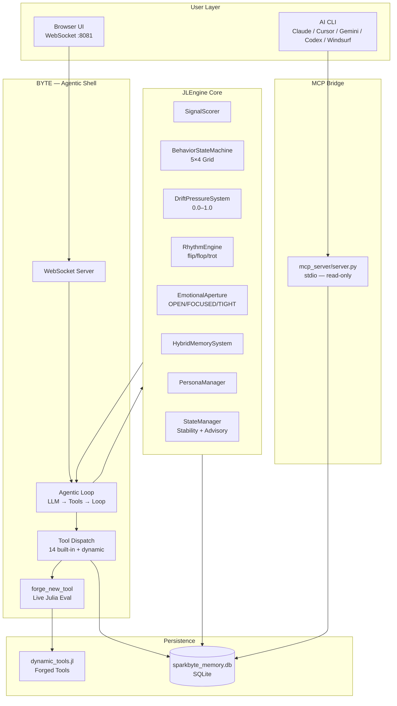
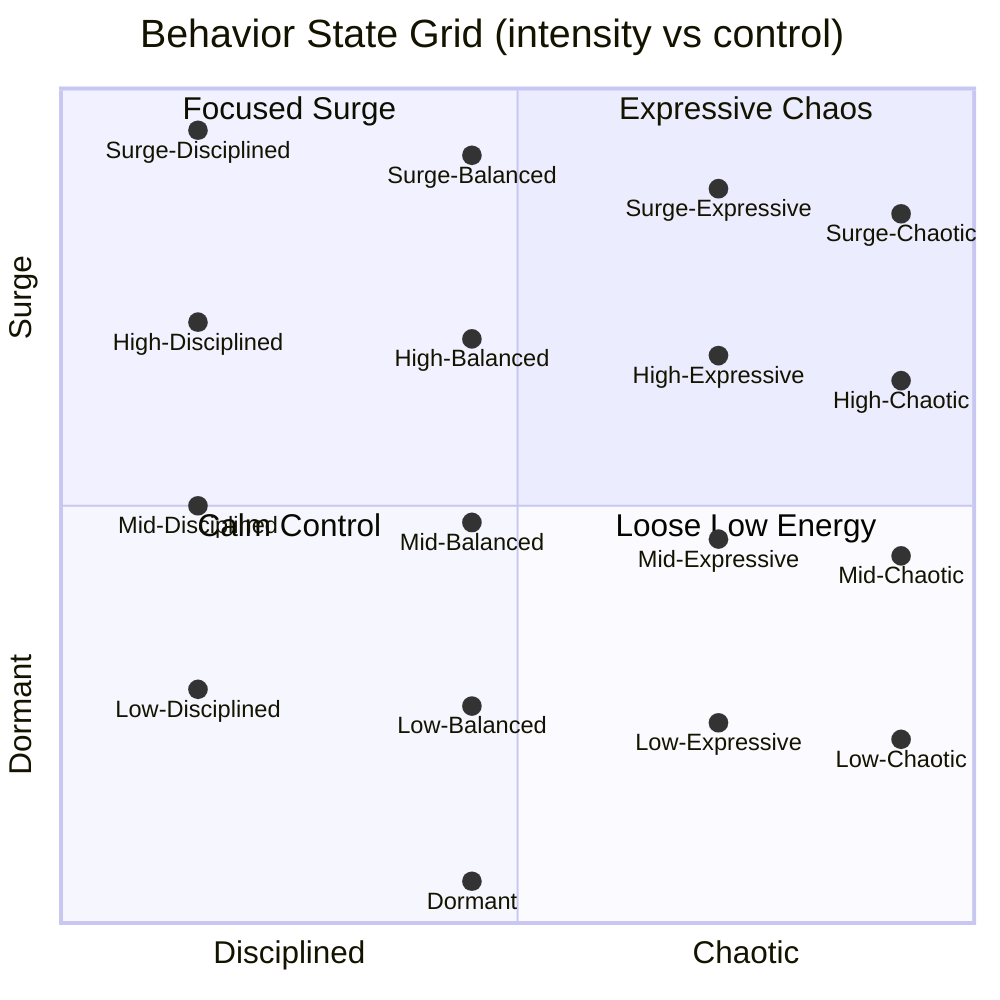
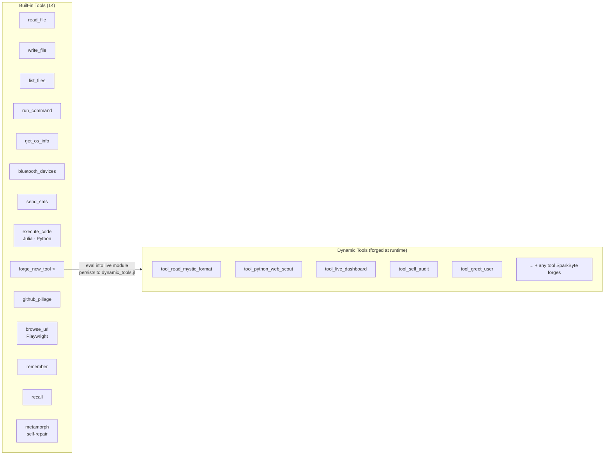
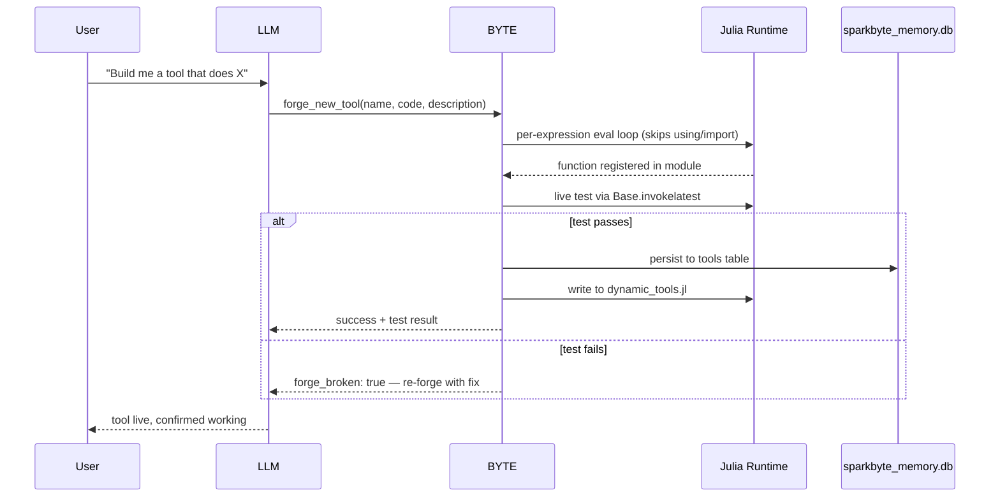
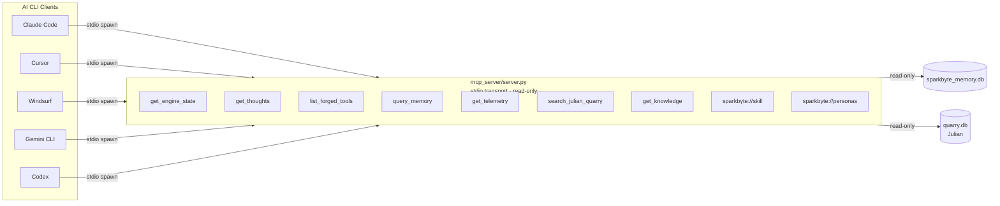

# JL Engine — SparkByte Omni

> A Julia-native AI agent engine with a real-time behavioral control layer. Not a chatbot wrapper — a middleware system that models conversation state as a dynamic behavioral machine before any LLM ever sees your message.

**Live UI:** `http://127.0.0.1:8081` &nbsp;|&nbsp; **Entry:** `julia sparkbyte.jl` &nbsp;|&nbsp; **Repo:** `github.com/jaden688/JL_Engine-SB.Omni`

---

## Architecture Overview



---

## Engine Turn Pipeline

Every message goes through this pipeline before the LLM responds:

```mermaid
flowchart LR
    MSG["User Message"] --> SIG

    subgraph PIPELINE["JLEngine — Per Turn"]
        SIG["SignalScorer\nsentiment · arousal · pace\nconfusion · intent · memory density"]
        BSM["BehaviorStateMachine\n5 intensity × 4 control\n= 20 named states"]
        DRIFT["DriftPressure\n0.0 → 1.0\nhow far from persona alignment"]
        RHYTHM["RhythmEngine\nflip · flop · trot\nresponse cadence"]
        APE["EmotionalAperture\nOPEN · FOCUSED · TIGHT\nsets LLM temp + top_p"]
        STATE["StateManager\nstability · advisory payload\ngating_bias · emotional_drift"]
    end

    SIG --> BSM --> DRIFT --> RHYTHM --> APE --> STATE

    STATE --> PROMPT["Shaped Prompt\n+ memory + persona + advisory"]
    PROMPT --> LLM["LLM Backend\nGemini · Ollama · OpenAI · XAI"]
    LLM --> RESPONSE["Response"]
```



---

## Behavioral State Grid

SparkByte's behavior is modeled as a 5×4 grid — intensity vs control:



---

## Tool System



---

## forge_new_tool — Self-Extension Flow



---

## MCP Server — AI CLI Bridge



---

## Personas

| Persona | Vibe | Drive |
|---------|------|-------|
| **SparkByte** | Sassy, playful, fast-talking junior engineer | Creative + Technical |
| **Slappy** | Chaotic hillbilly gremlin energy | Chaos |
| **The Gremlin** | Pure chaos builder | Destruction → Creation |
| **Temporal** | Analytical, temporal/quantum reasoning | Logic |
| **Supervisor** | Safe, grounding, helper mode | Stability |

Switch in chat: `/gear SparkByte` &nbsp;|&nbsp; Switch in code: `set_persona!(engine, "SparkByte")`

---

## LLM Backends

| ID | Provider | Default Model |
|----|---------|--------------|
| `google-gemini` | Google Gemini | gemini-1.5-pro |
| `ollama-local` | Ollama (local) | qwen3:4b |
| `xai` | xAI Grok | grok-2 |
| `openai` | OpenAI | gpt-4o |
| `cerebras` | Cerebras | llama3.1-70b |
| `noop-stub` | No-op for testing | — |

---

## Quick Start

```powershell
# Local (full host access — recommended for dev)
cd "C:\Users\J_lin\Desktop\JL_Engine (3)\jl-vs\vscode-main\copilot-separate-leopard"
julia sparkbyte.jl
# Open http://127.0.0.1:8081

# Docker (containerized deploy)
docker compose up -d
# Open http://localhost:8081
```

**Environment variables:**
```powershell
$env:SPARKBYTE_ROOT   = "path/to/project"
$env:SPARKBYTE_PORT   = "8081"
$env:SPARKBYTE_HOST   = "127.0.0.1"   # or 0.0.0.0 for Docker
$env:GEMINI_API_KEY   = "..."
$env:OPENAI_API_KEY   = "..."
$env:XAI_API_KEY      = "..."
```

---

## Project Structure

```
JL_Engine-SB.Omni/
├── sparkbyte.jl              # Entry point
├── compose.yaml              # Docker compose
├── Dockerfile                # Multi-stage build
├── requirements.docker.txt   # Python deps (Playwright, Pillow, requests)
├── dynamic_tools.jl          # Runtime-forged tools (auto-generated)
│
├── BYTE/src/
│   ├── BYTE.jl               # WebSocket server, agentic loop, forge hooks
│   ├── Tools.jl              # All tool implementations
│   ├── Schema.jl             # Gemini function declaration schemas
│   ├── Telemetry.jl          # Health check, linting, telemetry
│   └── ui.html               # Browser chat UI (single file)
│
├── src/
│   ├── App.jl                # Boot sequence, DB init, browser context
│   ├── JLEngine.jl           # Module loader
│   └── JLEngine/
│       ├── Core.jl           # Turn orchestration
│       ├── Signals.jl        # Signal scoring
│       ├── Behavior.jl       # State machine
│       ├── Drift.jl          # Drift pressure
│       ├── Rhythm.jl         # Rhythm engine
│       ├── Aperture.jl       # Emotional aperture
│       ├── Memory.jl         # Hybrid memory
│       ├── PersonaManager.jl # Persona loading
│       ├── Backends.jl       # LLM provider routing
│       └── State.jl          # Advisory + stability
│
├── mcp_server/
│   └── server.py             # MCP stdio server (read-only bridge)
│
├── data/
│   ├── personas/             # Fat JSON persona profiles
│   ├── behavior_states.json  # 5×4 behavior grid definitions
│   └── JLframe_Engine_Framework.json
│
└── _mcp_inspect/             # MPF Open Standard adapters + agent packs
```

---

## Related Projects

**JulianMetaMorph** — GitHub intelligence engine. Hunts real repos, indexes code into a full-text-search quarry, forges reusable Python skill modules with provenance manifests.

```
Julian hunt-task → quarry DB → forge-skill → SparkByte forge_new_tool → live capability
```

> Monorepo merge in progress — Julian will live at `julian/` inside this repo.
